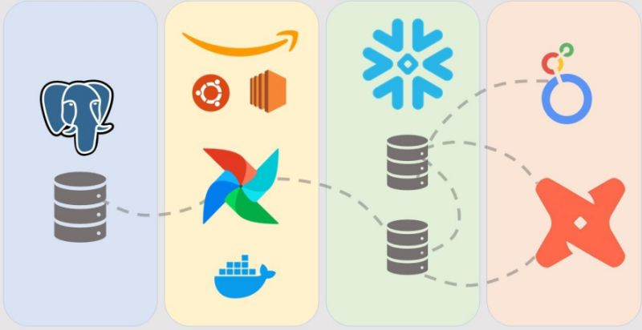

# Bootcamp Engenharia de Dados

Este repositório contém os arquivos utilizados no bootcamp Bootcamp Engenharia de Dados: Construa um Projeto Real - 2024.

Durante a realização do bootcamp foi mostrado como é possível configurar o Apache Airflow a parti de containers Docker, em uma máquina EC2 na Amazon Web Services, com isso criar uma DAG responsável por enviar os dados armazenados em um banco de dados PostgreSQL para o serviço de Data Warehouse Snowflake Computing, após a ingestão dos dados, foram criadas camadas de análise, dimensional e uma tabela de fato utilizando o dbt, utilizando os dados do data warehouse e assim realizar transformações nesses dados para que ficassem apresentáveis quando fossem consumidos em uma ferramenta de dashboard.

De forma geral, a pipeline de dados é um fluxo que envia os dados armazenados em um banco a partir do Apache Airflow para o Snowflake que são consumidos pelo dbt, que criará as camadas analíticas e disponibilizará os dados para uma ferramenta de dashboard.

